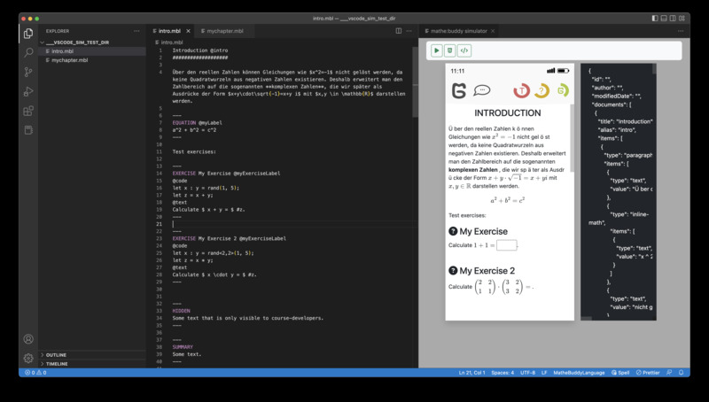

.. _frontend-index:

############
  Editor
############

Es gibt zwei Möglichkeiten Kurse für die App zu erstellen:

1. Nutzung des **Webeditors**. Hier ist keine Installation erforderlich (ACHTUNG: noch nicht verfügbar)
2. Nutzung von **Visual Studio Code**. Dies ermöglicht es auch offline zu arbeiten.

Webeditor
=========

(noch nicht verfügbar)

Visual Studio Code
==================

  
  Kursentwicklung in Visual Studio Code

Visual Studio Code kann hier `hier <https://code.visualstudio.com>`_ heruntergeladen werden.

Nach der Installation ist es erforderlich zwei Erweiterungen ("extensions") zu installieren.
Zukünftig werden diese direkt im *Marketplace* von Visual Studio Code verfügbar sein.
Aktuell ist jedoch eine manuelle Installation nötig.

1. Zunächst bezieht man die Dateien :code:`mathe-buddy-lang-VERSION.vsix` und :code:`mathe-buddy-sim-VERSION.vsix` über
`Github <https://github.com/mathebuddy/mathebuddy-downloads/tree/main/vscode-extensions>`_. Es sollte stets die neueste :code:`VERSION` bezogen werden.

2. Für die Installation startet man Visual Studio Code und wählt links im Hauptmenü **Extensions** ("Baustein-Icon"). Im sich öffnenden Panel klickt man oben links auf die drei Punkte ("...") und wählt :code:`install from VSIX`.

3. Man führt den Vorgang zweimal durch und wählt dabei nacheinander beide im Schritt 1. heruntergeladenen Dateien aus.
